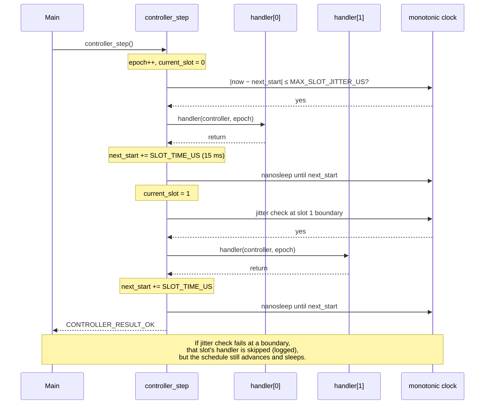

# Segling controller (C)

Onboard real-time loop for the Raspberry Pi autopilot: sensors, actuators, shared state, and timing. The Go backend reads memory-mapped state written from here; see the [repository root README](../README.md) for the full stack.

API reference: generate with `doxygen Doxygen.conf` (output under `docs/doxygen/html/`).

## Hierarchy of control

Control is layered: a small **core** owns the schedule and shared services; **integrations** run once per slot inside that schedule.

```text
                    ┌─────────────────────────────────────┐
                    │  main loop (cmd/main.c)             │
                    │    controller_init → step forever   │
                    └──────────────────┬──────────────────┘
                                       │
                    ┌──────────────────▼──────────────────┐
                    │  CONTROLLER (orchestration)         │
                    │  epoch counter, slot dispatch,      │
                    │  jitter checks, absolute sleeps     │
                    └──────────────────┬──────────────────┘
           ┌───────────────────────────┼───────────────────────────┐
           │                           │                           │
    ┌──────▼──────┐            ┌───────▼───────┐           ┌───────▼───────┐
    │ COMMS       │            │ STORAGE       │           │ LOGGING       │
    │ I2C or sim  │            │ mmap state    │           │ epoch/slot    │
    └─────────────┘            │ (Go-facing)   │           │ tagged lines  │
                               └───────────────┘           └───────────────┘
                                       │
                    ┌──────────────────▼──────────────────┐
                    │  INTEGRATIONS (slot handlers)       │
                    │  one *_step() per enabled slot    │
                    └─────────────────────────────────────┘
```

**Logical data flow within one epoch** (slot index order in `scheduling.h`):

1. **Sensing** — AHRS, GPS, barometer: read hardware, update filter/state, publish telemetry into storage for the matching `slot_id`.
2. **Actuation** — Rudder: apply actuator command from autopilot/state.
3. **Control** — Autopilot: consume sensor/state inputs, produce control decisions (e.g. rudder target).
4. **Interface** — Expose/commit state for the offboard stack (Wi‑Fi / Go).

Integrations are registered at build time in `controller.c` (`AHRS_ENABLED`, `GPS_ENABLED`, etc.). Disabled integrations leave a `NULL` handler; that slot still advances on the timeline but runs no code.

## Stepping mechanism

The runtime model is a **fixed slot schedule**, not ad-hoc callbacks.

| Call | Role |
|------|------|
| `controller_init` | Bring up logging, comms, storage; set `epoch` to 0. Failure is **unrecoverable** (`CONTROLLER_RESULT_ERROR_INIT_FAILED`). |
| `controller_step` | Run **one full epoch**: increment `epoch`, walk every slot index `0 … SLOT_COUNT-1`, then sleep through the final boundary. |
| `controller_deinit` | Tear down comms and storage. Failure is **unrecoverable** (`CONTROLLER_RESULT_ERROR_DEINIT_FAILED`). |

`main` calls `controller_step` in an infinite loop; each call is one epoch.

### What happens inside `controller_step`

1. **`epoch` is incremented** — shared logical time for all handlers in this round (`controller->epoch`). Handlers receive this value as their `epoch` argument and should treat it as the authoritative epoch for the round.
2. **`current_slot` starts at 0** and is updated as slots advance.
3. **For each slot index `i`** (see scheduling below):
   - Compare monotonic clock time to `next_slot_start_time`.
   - If jitter is within `MAX_SLOT_JITTER_US`, invoke `g_slot_handlers[i]` when non-`NULL`.
   - If jitter is **over** the limit, log an error and **skip** the handler for that slot.
   - Advance `next_slot_start_time` by `SLOT_TIME_US`.
   - Sleep until the next slot boundary (`clock_nanosleep` with `TIMER_ABSTIME`), except after the last index in the loop (one final sleep closes the epoch).
4. **State persistence** — writing controller state to storage after each slot is planned (`TODO` in `controller.c`).

Step failure from sleep errors surfaces as `CONTROLLER_RESULT_ERROR_UNKNOWN`. A partial epoch due to timing is logged; recoverable step semantics are described in `controller.h` (`CONTROLLER_RESULT_ERROR_STEP_FAILED`).

## Slot-based scheduling

Timing constants and slot IDs live in `include/controller/scheduling.h`.

| Symbol | Value | Meaning |
|--------|-------|---------|
| `SLOT_TIME_US` | 15000 | Nominal spacing between slot boundaries (**15 ms**). |
| `MAX_SLOT_JITTER_US` | 500 | Maximum allowed deviation from the scheduled boundary; beyond this, the slot handler is not run. |
| `SLOT_COUNT` | 16 | Number of slot indices per epoch (reserved headroom; not all indices are assigned). |

**Epoch duration (wall clock):** `SLOT_COUNT × SLOT_TIME_US` = **240 ms** per `controller_step`, independent of how long handlers take, because the loop always advances the schedule and sleeps to absolute times.

### Example: two-slot epoch (illustration)

Production uses `SLOT_COUNT = 16`; the same rules apply if you imagine only **two** slots (e.g. AHRS then INTERFACE) with `SLOT_TIME_US = 15 ms`:

```text
Monotonic time →
│
│  controller_step() begins
│  epoch ← N+1
│
├─ t0 ────────────────┬─ Slot 0 window (15 ms) ──────────────┐
│                     │  jitter OK? → run handler[0]       │
│                     │  next_start ← t0 + 15 ms            │
│                     └─────────────────────────────────────┘
│                     sleep until t0 + 15 ms (absolute)
│
├─ t0 + 15 ms ────────┬─ Slot 1 window (15 ms) ─────────────┐
│                     │  jitter OK? → run handler[1]       │
│                     │  next_start ← t0 + 30 ms            │
│                     └─────────────────────────────────────┘
│                     sleep until t0 + 30 ms (end of epoch)
│
└─ t0 + 30 ms         controller_step() returns
                      (epoch wall time = 2 × 15 ms = 30 ms)
```



| Event | `current_slot` | `next_slot_start_time` (conceptual) |
|-------|----------------|-------------------------------------|
| Enter step, `epoch` becomes N+1 | 0 | was `t0` (from previous epoch or init) |
| After slot 0 handler + advance | 1 | `t0 + 15 ms` |
| After slot 1 handler + advance | 1 (loop done) | `t0 + 30 ms` |
| After final sleep | — | ready for next epoch’s slot 0 at `t0 + 30 ms` |

### Assigned slot IDs

| Index | `slot_id_t` | Integration | Typical role |
|-------|-------------|-------------|--------------|
| 0 | `SLOT_ID_AHRS` | AHRS | IMU/magnetometer fusion |
| 1 | `SLOT_ID_GPS` | GPS | Position/velocity |
| 2 | `SLOT_ID_BAROMETER` | Barometer | Pressure/altitude |
| 3 | `SLOT_ID_RUDDER` | Rudder | Actuator output |
| 4 | `SLOT_ID_AUTOPILOT` | Autopilot | Control law |
| 5 | `SLOT_ID_INTERFACE` | Interface | Go/mmap interface |
| 6–15 | — | *(reserved)* | No handler; timeline still advances |

Handlers are function pointers of type `controller_slot_handler_t`:

```c
void handler(controller_t *controller, epoch_t epoch);
```

Slot index `i` in the step loop must match the integration’s `SLOT_ID_*` when registered in `g_slot_handlers`.

## Constraints integrators should respect

These are the rules the core expects; violating them shows up as missed slots, stale mmap data, or inconsistent epochs.

### Timing and scheduling

- Handlers run only on **monotonic** time (`CLOCK_MONOTONIC`); slot boundaries are absolute, not cumulative drift per handler.
- A handler is **skipped** if the core is more than **`MAX_SLOT_JITTER_US` late** relative to `next_slot_start_time` — design work to fit comfortably inside **15 ms** per slot, including I2C and storage I/O.
- Indices **6–15** have no handlers today but still consume **15 ms** each; do not assume the epoch ends after slot 5.
- Do not block the step loop longer than the remaining slot budget; there is no watchdog yet beyond jitter skip.

### Epoch and slot identity

- Use the **`epoch` argument** passed into `*_step` for logging (`log_message` / `log_messagef`) and for any cross-check against `controller->epoch`.
- Use the correct **`slot_id_t`** when reading/writing storage for that integration’s mmap file.
- `controller->current_slot` reflects progress within the epoch during the step loop; do not assume it is updated inside your handler unless the core changes that later.

### Lifecycle and dependencies

- **`controller_init` must succeed** before `controller_step`; comms and storage must be ready.
- Integrations should use **`controller->comms`** for bus access and **`controller->storage`** for shared state with the Go process (see `storage.h` for per-slot mmap layout).
- **Compile-time enable flags** must match linked objects: an enabled slot without a `*_step` implementation will not be called; a disabled slot must not be required by other code in the same build.

### Storage and offboard readers

- Telemetry and commands use **`storage_write` / `storage_read` / `storage_commit`** keyed by `slot_id_t`; the Go backend assumes a consistent layout (`STORAGE_FILE_SIZE`, seqlock rules for specific slots — see `storage.h`).
- Readers offboard should tolerate **epoch** stamped in slot files and expect updates once per epoch per active integration.

### Logging

- Prefer **`log_messagef(controller->epoch, slot_id, …)`** with your integration’s `SLOT_ID_*` so logs correlate with schedule.
- Avoid verbose logging on deployment (`controller_config.log_level`; stdio cost on the Pi).

### Handler contract

- Signature must match **`controller_slot_handler_t`**.
- Handlers must be **reentrant only across epochs**, not across slots in the same epoch unless you provide your own locking; the core does not serialize integration-side shared globals.
- Return values are **void**; report integration failures via result enums internally, storage flags, or logs — the core does not yet aggregate per-slot errors into `CONTROLLER_RESULT_ERROR_STEP_FAILED` automatically.

## Comms backends

`comms.h` defines `COMMS_BACKEND_HARDWARE` / `COMMS_BACKEND_SIM` as numeric tokens. The Makefile accepts `COMMS_BACKEND=HARDWARE` or `SIM` and passes `-DCOMMS_BACKEND=COMMS_BACKEND_*`. All of `src/*.c` is built; `comms_hardware.c` and `comms_sim.c` wrap their bodies in `#if COMMS_BACKEND == …` so the inactive file preprocesses to an empty translation unit.

| `COMMS_BACKEND` | Linked module | Use |
|-----------------|---------------|-----|
| `SIM` (Makefile default) | `comms_sim.c` | Per-device files under `simulated_data/` |
| `HARDWARE` | `comms_hardware.c` | Linux I2C (`I2C_DEVICE`, e.g. `/dev/i2c-1`) |

## Build

One `Makefile` at the repo root of `controller/` (shared flags for app and tests). Artifacts go under `build/`.

```bash
make generate-sim-data                          # 10 binary frames per device (default)
make generate-sim-data SIM_SEED=99 SIM_FRAMES=20

make                                          # build/segling-controller
make test                                     # build/run_tests
make check                                    # run unit tests
make clean

make COMMS_BACKEND=SIM COMMS_SIM_DATA_DIR=simulated_data
make COMMS_BACKEND=HARDWARE I2C_DEVICE=/dev/i2c-1
make check COMMS_BACKEND=SIM
```

`tests/Makefile` only forwards to the parent (`make -C .. check`).

The C preprocessor cannot compare string literals in `#if`, so the Makefile maps the user-facing `HARDWARE`/`SIM` names to the numeric tokens in `comms.h`.

### SIM: address → file map

On first I2C access to an address, `comms_sim.c` loads the matching file from `COMMS_SIM_DATA_DIR`:

| I2C address | File | Integration |
|-------------|------|-------------|
| `0x68` | `imu.dat` | AHRS accel/gyro burst @ `0x3B` |
| `0x0C` | `mag.dat` | AHRS magnetometer @ `0x02` |

Add a `case` in `comms_sim.c` and a generator function in `scripts/generate_sim_data.py` for each new sensor.

Per-file format: **raw binary**, `frame_count × frame_len` bytes with no separators. Frame width is fixed per device (`imu.dat`: 14 bytes; `mag.dat`: 6 bytes). Load uses `fseek` to each `line_index × frame_len`; each successful read advances the index. After the last frame, further reads fail as a **disconnected device**.

```bash
make generate-sim-data SIM_SEED=42 SIM_FRAMES=10
# or: uv run python scripts/generate_sim_data.py --seed 42 --frames 10 --out-dir simulated_data
```

Writes seek into the same contiguous binary layout in place (`rb+`); `comms_deinit` closes open files.

## Layout

| Path | Purpose |
|------|---------|
| `include/controller/` | Core: controller, comms, storage, scheduling, logging |
| `include/integrations/` | Per-device modules (AHRS, GPS, …) |
| `src/` | Implementations |
| `cmd/main.c` | Process entry: init → step loop |
| `tests/` | Unit test sources (`make check` from controller root) |
| `build/` | Compiled objects and binaries (gitignored) |
| `Doxygen.conf` | API documentation config |
